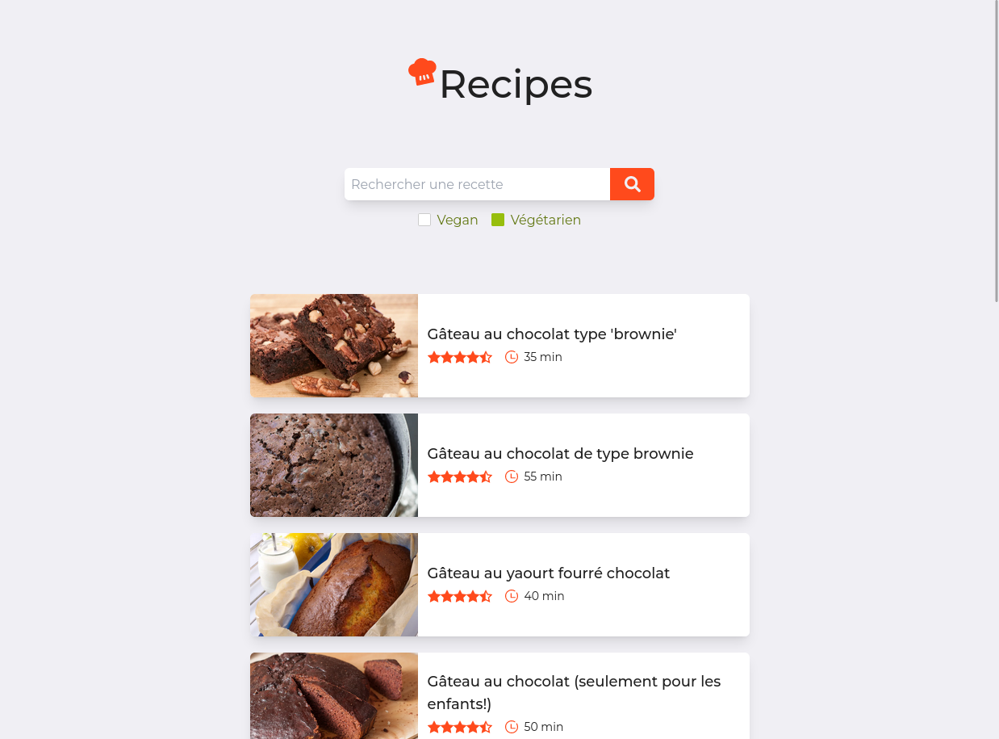

</a>

# Recipes

A simple site that retrieves recipes via marmiton to display in a slightly more pleasant way.

## Screenshot



## Tech Stack

**Client:** Eta, TailwindCSS

**Server:** Node, NestJS

## Deployment

### Production

To deploy this project run

```bash
  npm install
  npm run build
  npm run start
```

### Development

Install the dependencies

```bash
  npm install
```

Then, run these two commands in parallel

```bash
  npm run start:dev
  npm run tailwind:dev
```

### Docker

Docker images are automatically built and hosted on my gitlab registry (`registry.chevro.fr/cestoliv/recipes`)

The directory also contains a `docker-compose.yml` file.

## API Reference

### Search for a recipe

```http
  GET /api/v1/recipes/search/${query}
```

| Parameter    | Type      | Description                            |
| :----------- | :-------- | :------------------------------------- |
| `query`      | `string`  | **Required**. The search               |
| `vegan`      | `boolean` | **Optionnal**. Vegan-only recipes      |
| `vegetarian` | `boolean` | **Optionnal**. Vegetarian-only recipes |

### Get a recipe

```http
  GET /api/v1/recipes/${id}
```

| Parameter | Type     | Description                       |
| :-------- | :------- | :-------------------------------- |
| `id`      | `string` | **Required**. Id of recipe to fetch |

The id of a recipe is this part of the url of a recipe: marmiton[.]org/recettes/recette_**fajitas-vegetariennes_336211**.aspx

## License

[MIT Licensed](LICENSE)
